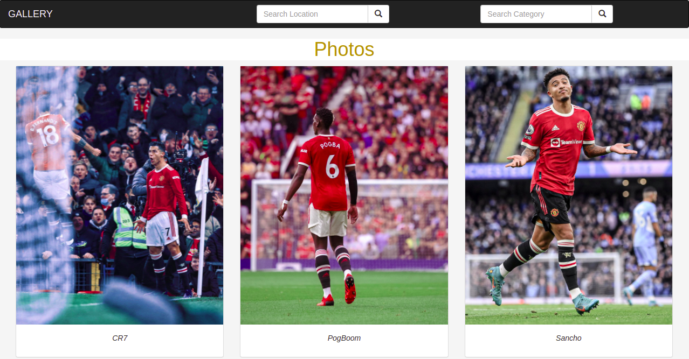

# My Gallery

#### A website that displays different photos and their details.

#### By **Lewis Murgor**

## Below is a part of the project.

## Description
This is a website that displays different photos and their details.A user can also search the image categories and location.

## Setup/Installation Requirements
* You can clone this repository by running 'git clone https://github.com/lewis-murgor/gallery' in your terminal.
* Create a virtual environment.
* Install pip
* Run 'pip install -r requirements.txt' to install all the dependencies.

## Known Bugs
The application has no known bugs.

## Live Site
The live link of the project is  https://gallery-lewis.herokuapp.com/

## Technologies Used
* Python
* Django
* HTML
* Css

## Support and contact details
You can contact me through the email kiplagatlewis29@gmail.com
### License
You can check the licence [here](https://github.com/lewis-murgor/gallery/blob/master/Licence)
##
Copyright (c) 2022 
##
**Lewis Murgor**